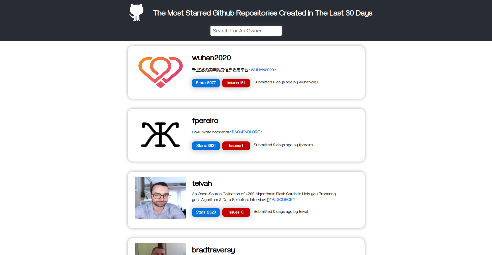

# The Most Starred Github Repos

> This small webApp is a github API consumer that basically will get all the most starred github repos that were created in the last 30 days. and effectively this is a coding challenge for a Front-End Developer role.

## Built With

- HTML, CSS,
- Flexbox,
- mediaQueries,
- ReactJS.

## Live Demo

[Live Demo Link](http://raw.githack.com/elmejdki/TNW-clone/create-home-page/index.html)

## Getting Started

To get a local copy up and running follow these simple example steps.

### Prerequisites

To make this repository working in your local machine you need to install at least nodejs so you can have access to the npm, and run this commands on root of the project folder:

> npm install
> npm run start

## Author

👤 **Zakariae El Mejdki**

- Github: [@elmejdki](https://github.com/elmejdki)
- Twitter: [@ZakariaeElMEjdki](https://twitter.com/0ca7848f87ab470)
- Linkedin: [Zakariae El Mejdki](https://www.linkedin.com/in/zakariae-el-mejdki-644898139/)

## Choice of Technology

I have chosen to work with the Framework ReactJS as I'm more familiar with it than other front-end frameworks, and because of course of his virtual DOM which is one of the best development tools and its unrivaled ecosystem.

## 🤝 Contributing

Contributions, issues and feature requests are welcome!

Feel free to check the [issues page](https://github.com/elmejdki/TNW-clone/issues).

## Show your support

Give a ⭐️ if you like this project!

## Acknowledgments

a big hat to me and my partner Brenda and anyone who help us either by openning issues on this repository or reviewing our code :)

## 📝 License

This project is [MIT](lic.url) licensed.
